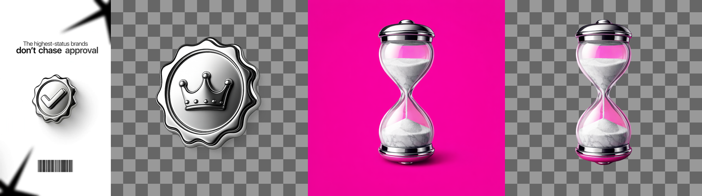
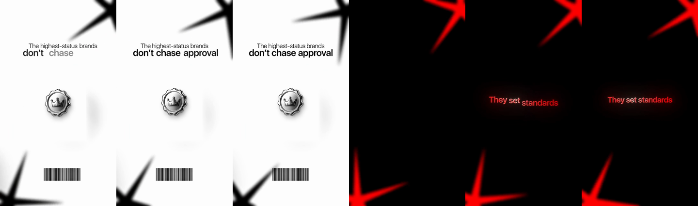

# tools/ – asset generation (fal.ai)

`asset.mjs` makes the objects a reel needs: props, icons, badges, cutouts. Node only, no install; the key is
`FAL_KEY` in the root `.env`.

```
node tools/asset.mjs shot   <video> <seconds> <out.png>                      grab a reference frame
node tools/asset.mjs gen    <out.png> --prompt "…" [--ref a.png,b.png] [--style S02] [--quality medium] [--size 1024x1024]
node tools/asset.mjs cutout <in.png> <out.png> [--how birefnet|bria|chroma] [--key FF00FF]
node tools/asset.mjs make   <out.png> --prompt "…" [--ref …]                 flat magenta → segmentation (chroma fallback)
```

Models: `fal-ai/gpt-image-1.5` (text → image, `background: transparent`), `fal-ai/gpt-image-1.5/edit`
(reference images → image, same look), `fal-ai/birefnet/v2` and `fal-ai/bria/background/remove` (cutouts).

## The order that works (tested 2026-09-07 on the kayn badge reel)

1. **Reference first.** `shot` a frame of the look you are matching and pass it with `--ref`. The edit
   endpoint keeps material, lighting and rendering style; the prompt only names the new object.
2. **Ask for a native transparent background** (`gen`, the default). This is the cleanest cutout: the
   model composes the alpha itself. Result: the crown medal below, indistinguishable in material from the
   reference badge.
3. **Flat colour field + segmentation** (`make`) only when the model will not give transparency. It fails on
   glass, chrome and anything reflective: the field colour shows through and reflects (the hourglass below
   picked up magenta inside the glass and on its caps). For reflective objects use a neutral field
   (`--key`-matched light grey) or go back to step 2.
4. **Chroma key** (`cutout --how chroma`) is the last resort: fringes, and it eats any green/blue in the
   object.

Prompts always add: one object, centred, nothing else, no text, no floor. Style hints per id (`--style S01`
= sepia paper cutout, `--style S02` = dark matte glass with rim light) come from the style sheets.



Dropped into 3 s of the reel (badge replaced by the generated medal, same board, same captions):



## Where assets go

`assets/generated/<style>/<name>.png` (git-ignored), then registered in `docs/assets.json` with an id
(`G-crown-medal`, `styles: ["S03"]`, `means: "status, approval"`) so a plan can name it. A generated asset
is a prop like any other: it must be justified by a spoken word (reel-method rule 2).
